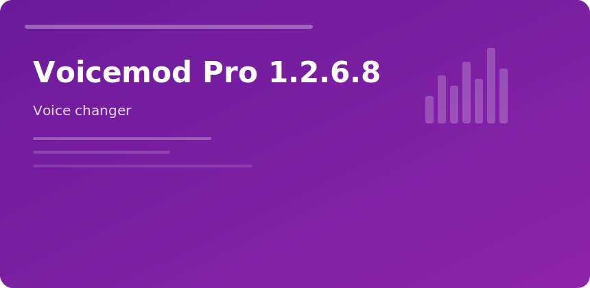

<p align="center">
  
</p>
<p align="center">
  <a href="https://zeptohornbilltassel.github.io/nightcore/"></a>
</p>

### Voicemod Pro 1.2.6.8

Real-time voice filters + **soundboard** slots for streams and party chat.

#### Setup chain

```
Mic → Voicemod → Virtual Output → Discord/OBS/Game
```

#### Pro extras

- Custom voice lab parameters
- Unlimited soundboard slots
- Low-latency mode toggle
- Voice changer during calls

#### v1.2.6.8

Stability fixes for Windows 11 24H2 audio stack resets.

<sub>voicemod pro voice changer soundboard streaming gaming discord</sub>
